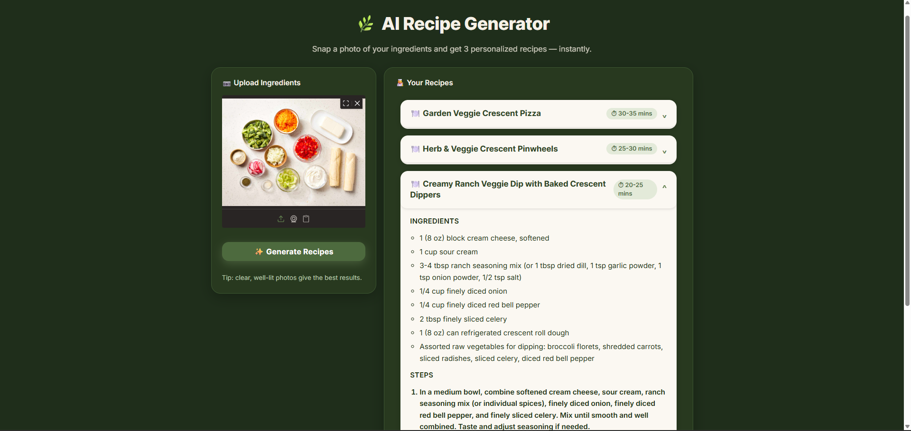

# AI Recipe Generator

An AI-powered web application that transforms ingredient photos into personalized recipes with step-by-step instructions.

## Overview

AI Recipe Generator is a multimodal AI application that analyzes ingredient images and generates personalized recipes using Google Gemini 2.5 Flash and LangChain.

Users can upload a photo of available ingredients and receive:

- Detected ingredients
- Three AI-generated recipe suggestions
- Estimated cooking times
- Ingredient lists
- Step-by-step cooking instructions

The project includes both a command-line version and a modern Gradio web application with an interactive recipe-card interface.

---

## Features

- Image-based ingredient detection
- AI-generated recipe recommendations
- Step-by-step cooking instructions
- Estimated cooking times
- Interactive expandable recipe cards
- Modern sage-green themed UI
- Loading animations and error handling
- Command-line and web application versions
- Powered by Google Gemini 2.5 Flash through LangChain
  
---

## How It Works

1. The user uploads an image of ingredients through the Gradio web interface.
2. The image is converted into Base64 format.
3. A system prompt instructs Gemini to identify ingredients and generate recipes.
4. The image and prompt are sent to Google Gemini 2.5 Flash through LangChain.
5. The model returns structured recipe data in JSON format.
6. The application converts the response into interactive recipe cards displaying:
   - Recipe title
   - Cooking time
   - Ingredients
   - Step-by-step instructions

---

## Screenshots

### Generated Recipes

Example output showing three AI-generated recipes displayed as expandable recipe cards.



---

## Project Structure
```text
ai-recipe-generator/
│
├── gradio_app.py
├── recipe_cli.py
├── images/
│   └── ingredients.jpg
├── screenshots/
│   ├── example.png
├── .env.example
├── .gitignore
├── requirements.txt
└── README.md
```


---

## Setup Instructions

### 1. Clone the repository

```bash
git clone https://github.com/dhvani-vora/ai-recipe-generator.git
cd ai-recipe-generator
```


### 2. Create virtual environment (recommended)

```bash
python -m venv venv
venv\Scripts\activate (Windows)
source venv/bin/activate (Mac/Linux)
```

### 3. Install dependencies

```bash
pip install -r requirements.txt
```

### 4. Add API key

Create a `.env` file in the root directory:

```env
GOOGLE_API_KEY=your_api_key_here
```

---

## How to Run

Run the script using:

1. CLI Version: 
```bash
python recipe_cli.py
```
2. Web Application:
```bash
python gradio_app.py
```
Open
```
http://127.0.0.1:7860/
```

Make sure the image path inside the script points to a valid image file.

---

## Future Improvements

- Nutrition and calorie estimation
- Cuisine-specific recipe generation
- Recipe difficulty levels
- Recipe saving and favorites
- Deployment using Hugging Face Spaces or Render
- Voice-based ingredient input
- Ingredient substitution recommendations

---

## Tech Stack

- Python
- Gradio
- LangChain
- Google Gemini 2.5 Flash
- HTML/CSS
- Base64 Encoding
- python-dotenv

---

## Key Learning Outcomes

Through this project, I gained experience with:

- Multimodal AI applications
- Prompt engineering
- LLM-powered image analysis
- Structured JSON outputs
- LangChain integrations
- Frontend development with Gradio
- Custom UI design using HTML and CSS
- API-based application development

---

## Notes

- This is a learning project built to understand multimodal AI systems
- The system uses prompt engineering to guide multimodal reasoning (image + text input).
- Image interpretation and recipe generation are handled in a single pipeline

---
